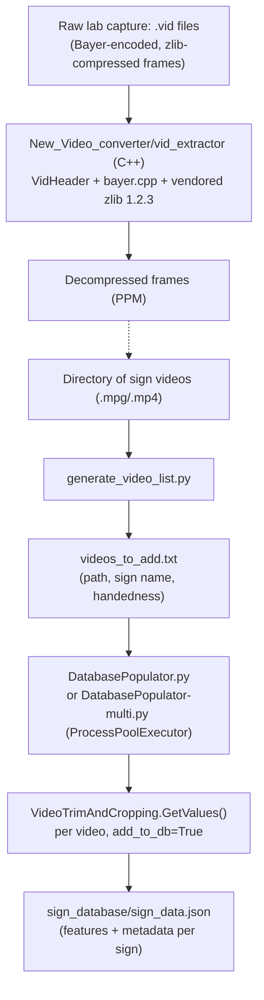
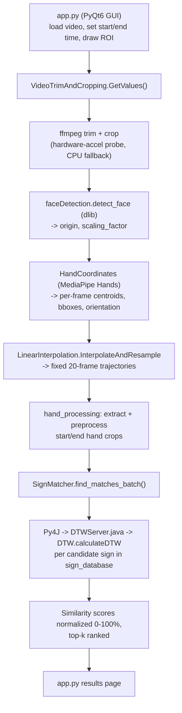
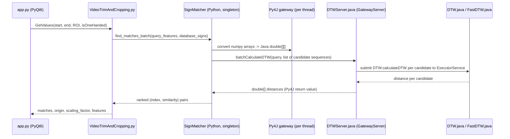

# SignDetection

Video-based sign language lookup: given a short video clip of a sign, find the closest matches in a reference database using hand-motion trajectory comparison (Dynamic Time Warping).

**Status: Research project.** Built solo, under the guidance of Professor Vassilis Athitsos in the UT Arlington CSE department, implementing the approach from the group's published paper. It is a working pipeline, not a packaged or deployed tool: there is no bundled dataset, no CI, and no measured accuracy numbers checked into the repo.

## Problem statement

Looking up a sign in a large sign-language vocabulary from video is hard: the same sign varies in speed, framing, and hand shape between signers and even between repetitions by the same signer. Naive frame-by-frame comparison doesn't tolerate that variation. This project implements a query-by-example system: sign a gesture on camera, and the system normalizes the hand motion, aligns it against a database of known signs with Dynamic Time Warping, and returns a ranked list of candidate matches.

It implements the method described in:

> **A System for Large Vocabulary Sign Search**
> Haijing Wang, Alexandra Stefan, Sajjad Moradi, Vassilis Athitsos, Carol Neidle, Farhad Kamangar
> Computer Science and Engineering Department, University of Texas at Arlington

## Core functionality

- **GUI capture and annotation** (`app.py`, PyQt6): load a video, scrub to the start/end of the sign, draw a region of interest around the signing space, flag one- vs two-handed signs, and trigger recognition.
- **Video preprocessing** (`VideoTrimAndCropping.py`): trims/crops the clip with ffmpeg, probing for available hardware acceleration (VideoToolbox on macOS, CUDA, Intel Quick Sync, VA-API, DXVA2/D3D11VA on Windows) and falling back to multi-threaded CPU encoding.
- **Face-relative normalization** (`faceDetection.py`, dlib frontal face detector): the face position and size give the origin and scale used to normalize hand coordinates, mirroring the paper's normalization step.
- **Hand tracking** (`HandCoordinates.py`, MediaPipe Hands): per-frame dominant/non-dominant hand centroids, bounding boxes, and motion orientation vectors, with hands sorted left/right by horizontal position.
- **Feature extraction** (`LinearInterpolation.py`, `hand_processing.py`): trajectories are resampled to a fixed 20-frame length, and start/end hand crops are skin-masked, grayscale-normalized, and resized for appearance comparison, following the same general approach as the paper.
- **DTW matching** (`sign_matcher.py`, `DTW.java`, `FastDTW.java`, `DTWServer.java`): the Java side does the actual Dynamic Time Warping; Python drives it over Py4J. A weighted combination of motion-feature distances plus hand-appearance distance produces a single similarity score per candidate, normalized to a 0-100% scale.
- **Database population** (`DatabasePopulator.py`, single-process; `DatabasePopulator-multi.py`, multi-process via `ProcessPoolExecutor`): batch-process a directory of reference videos into `sign_database/sign_data.json`.
- **Raw capture decoding** (`New_Video_converter/`, C++): a standalone tool (`vid_extractor`) for decoding the lab's proprietary Bayer-encoded, zlib-compressed `.vid` capture format into individual frames, ahead of any of the Python processing above.
- **Algorithm comparison scripts** (`benchmark.py`, `compareSigns.py`, `rank.py`, `DTWNormal.py`, `FastDTW.py`): compare standard DTW vs. FastDTW, and Python vs. Java-via-Py4J, on synthetic motion patterns (`signPatterns.py` generates circle/wave/zigzag trajectories, not real sign data). Useful for sanity-checking the algorithm implementations and relative speed, not for accuracy claims.

No accuracy, latency, or dataset-size numbers are checked into the repo (`benchmark_results.json` is git-ignored), so none are claimed here; see Known limitations.

## Architecture

### 1. Dataset preparation and database population



The C++ `vid_extractor` path and the Python `generate_video_list.py` path both terminate in ordinary video files that `DatabasePopulator` consumes; the `.vid` decoder is a preparatory step for archival lab recordings, not something the Python pipeline calls directly.

### 2. Recognition-time execution



### 3. Python-to-Java integration (Py4J)



`DTWServer.java` must be started first (`java DTWServer`) and stays up as a local JVM process; Py4J connects to it over a local socket rather than any network API. `SignMatcher` keeps one gateway per worker thread (`threading.local()`) so multiple batches can be in flight without serializing on a single connection, and prefers the batch RPC (`batchCalculateDTW`) over one call per candidate to cut down on Py4J round-trip overhead.

## Key technical decisions

- **DTW in Java, orchestration in Python.** The DTW/FastDTW core is implemented in Java (`DTW.java`, `FastDTW.java`) and exposed to Python via a persistent Py4J `GatewayServer` (`DTWServer.java`), rather than reimplementing DTW natively in Python or wrapping a C extension. `benchmark.py`/`compareSigns.py` exist specifically to compare the Python and Java implementations against each other.
- **Batched RPC over per-comparison RPC.** `find_matches_batch` sends the whole candidate set to Java in one `batchCalculateDTW` call, which parallelizes the distance computations across a Java `ExecutorService` server-side, instead of paying a Py4J round trip per candidate sign.
- **Face-relative normalization, not raw pixel coordinates.** Hand centroids are recentered on the detected face position and scaled by face size (dlib), so the same sign performed at different distances from the camera produces comparable trajectories.
- **Fixed-length resampling.** Variable-length hand trajectories are linearly interpolated to a fixed 20 frames (`LinearInterpolation.py`) before DTW, matching the paper's normalization step.
- **Motion + appearance, weighted.** The match score combines DTW distance over several motion features (dominant/non-dominant centroids, inter-hand distance, orientation vectors) with a separate hand-appearance distance (skin-masked, normalized start/end hand crops), using fixed weights mirroring the paper's weighted-combination approach.
- **Best-effort hardware acceleration.** ffmpeg trimming probes for VideoToolbox/CUDA/QSV/VAAPI/DXVA2 and falls back to multi-threaded CPU encoding; MediaPipe runs at `model_complexity=0` for CPU-friendliness. None of this is benchmarked in-repo; treat it as a portability affordance, not a performance claim.
- **A separate C++ tool for the lab's raw format.** `New_Video_converter/` decodes a legacy Bayer + zlib `.vid` capture format used for some of the lab's archival recordings. It is vendored with a full copy of zlib 1.2.3 (including Windows/Delphi/Ada bindings unrelated to this project) rather than a slim dependency (see Known limitations).

## Setup

Requires Python 3.9+, a JDK (for the DTW server), and ffmpeg on `PATH`.

```bash
git clone https://github.com/V-prajit/SignDetection.git
cd SignDetection

python -m venv venv
source venv/bin/activate   # Windows: venv\Scripts\activate

pip install PyQt6 opencv-python numpy ffmpeg-python py4j mediapipe scipy dlib
```

`dlib` is required (used by `faceDetection.py`) but has no pinned version or `requirements.txt` in the repo; install whatever wheel is available for your platform. There are no secrets or environment variables to configure; all paths (video files, `sign_database/`) are passed as CLI arguments or picked via the GUI file dialog.

Optional, platform-specific acceleration:
- NVIDIA: CUDA + a CUDA-enabled OpenCV build.
- Apple Silicon: `tensorflow-metal` (optional; MediaPipe/ffmpeg acceleration works without it via VideoToolbox).

Compile the Java side:
```bash
javac DTW.java FastDTW.java DTWServer.java
```

## Usage

1. Start the DTW server (leave it running):
   ```bash
   java DTWServer
   ```
2. Launch the GUI:
   ```bash
   python app.py
   ```
3. In the GUI: load a video, set the start/end time of the sign, draw a region of interest around the signing space, check "One-Handed Video" if applicable, then "Process Video" to see ranked matches.

### Building the reference database

```bash
python generate_video_list.py /path/to/videos
# review/edit the generated videos_to_add.txt

python DatabasePopulator-multi.py --workers 4 --batch_size 10 --video_list videos_to_add.txt
```
`generate_video_list.py` writes handedness as `true` for every row (there is no `--one-handed` flag); edit `videos_to_add.txt` by hand to mark one-handed signs correctly before populating the database. (`DatabasePopulator.py` is the single-process version of the same tool and does not accept `--workers`/`--batch_size`; use `-multi` for parallel population.)

### Algorithm comparison scripts

```bash
python benchmark.py   # standard DTW vs FastDTW vs Java-via-Py4J, on synthetic patterns
python rank.py         # rank benchmark_results.json by a chosen metric
python compareSigns.py # standard DTW vs FastDTW timing/distance comparison
```
These compare implementations against each other on synthetic geometric patterns (`signPatterns.py`), not against real sign-language data; treat their output as implementation sanity checks, not accuracy results.

## Testing

`test_sign_matching.py` is an ad hoc smoke script (random feature vectors through `SignDatabase` and `SignMatcher`, printed output, no assertions) run directly with `python test_sign_matching.py`. There is no test framework, no CI, and no coverage measurement in the repo.

## Known limitations

- **No bundled dataset or trained/tuned parameters.** The feature weights (`f1`..`f6`, `f_hand` in `sign_matcher.py`) are fixed constants mirroring the paper, not fit or validated against a database in this repo.
- **No accuracy or latency numbers in-repo.** `benchmark_results.json` is git-ignored and not committed; there is nothing here to cite for match accuracy or processing speed.
- **`video_manager.py` appears to be an orphaned utility.** It manages its own `video_database.json` and isn't imported by `app.py`, `DatabasePopulator.py`, or `DatabasePopulator-multi.py`, which use `database_manager.SignDatabase` and `sign_database/sign_data.json` directly. Needs owner confirmation on whether it's still in use.
- **Vendored zlib 1.2.3 source tree.** `New_Video_converter/zlib/` includes a full copy of zlib 1.2.3 (~17 MB, including Windows/Ada/Pascal/Delphi bindings and build artifacts unrelated to this project) committed directly rather than pulled in as a slim dependency. This is also why GitHub reports "SWIG" as the repo's primary language: it's an artifact of this vendored tree's file extensions, not anything SWIG-related in the actual project.
- **No `requirements.txt` / dependency pinning**, and no `LICENSE` file.
- **Manual, GUI-driven workflow.** There's no headless/batch "evaluate against a labeled test set" mode; recognition is invoked one clip at a time through the PyQt6 GUI (or by calling `GetValues` directly).

## Personal contribution

Solo project. All 26 commits (Jan 2024 - Apr 2025) are authored by Prajit Viswanadha, including the video capture/ROI GUI, face-relative normalization, MediaPipe-based hand tracking and feature extraction, the Java DTW/FastDTW implementation and the Py4J integration layer, the batch database populators, and the algorithm-comparison scripts. `New_Video_converter/` wraps the research group's pre-existing raw-capture format and a vendored zlib; the surrounding build/integration work is original.

## Attribution

Developed under the guidance of Professor Vassilis Athitsos, UT Arlington CSE, implementing the method from Wang, Stefan, Moradi, Athitsos, Neidle, and Kamangar, "A System for Large Vocabulary Sign Search."

## License

No `LICENSE` file is present in this repository. Until one is added, all rights are reserved by default; add a license (for example MIT or Apache-2.0) if you intend this to be reused.
